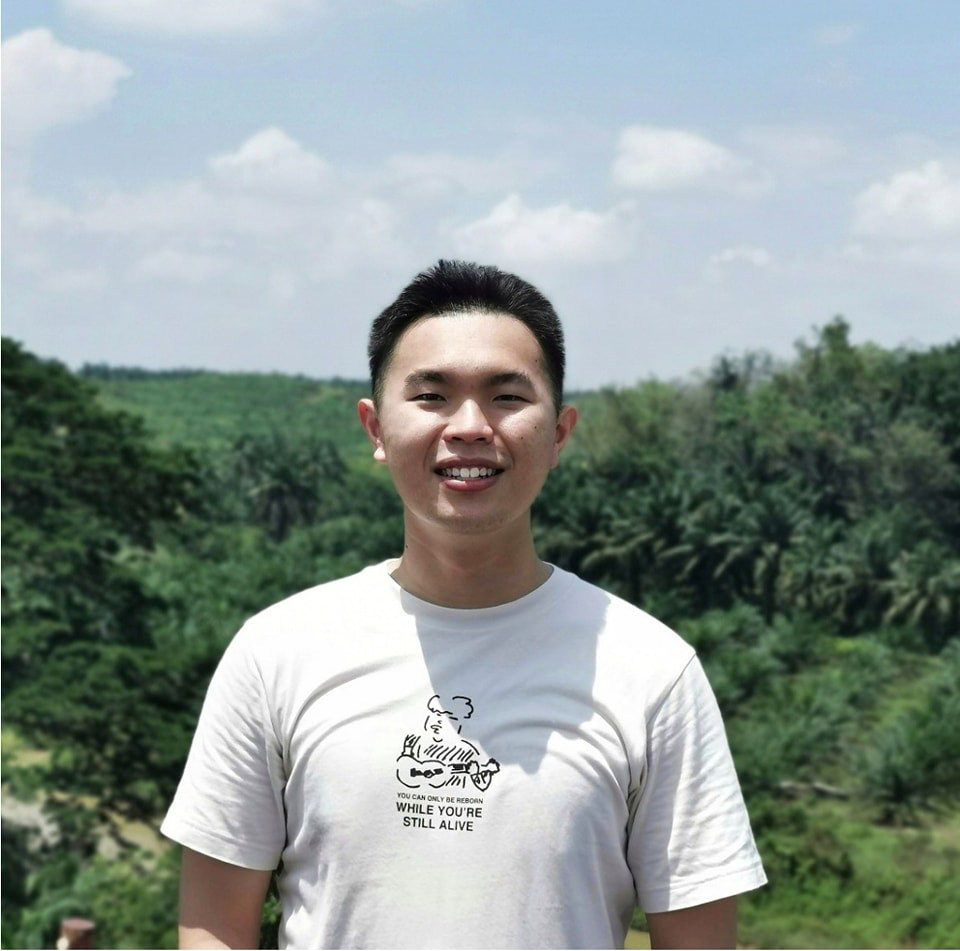
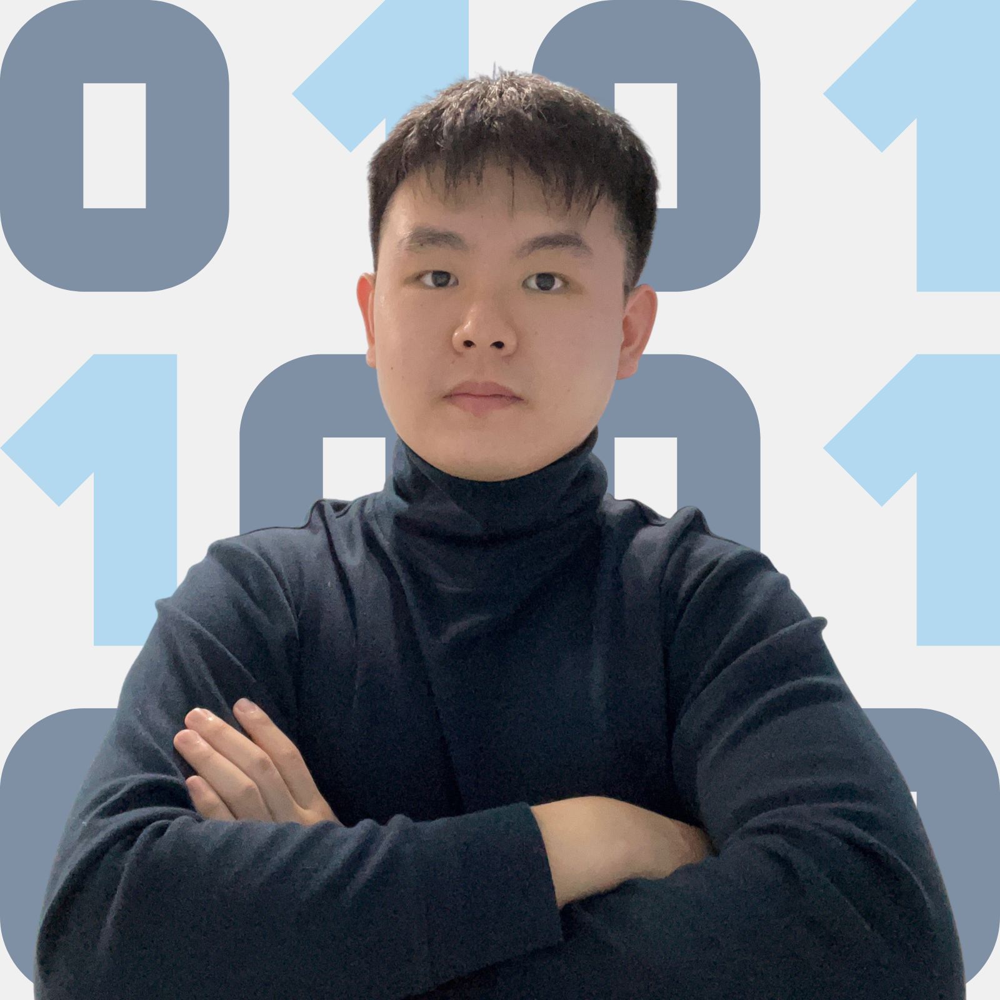
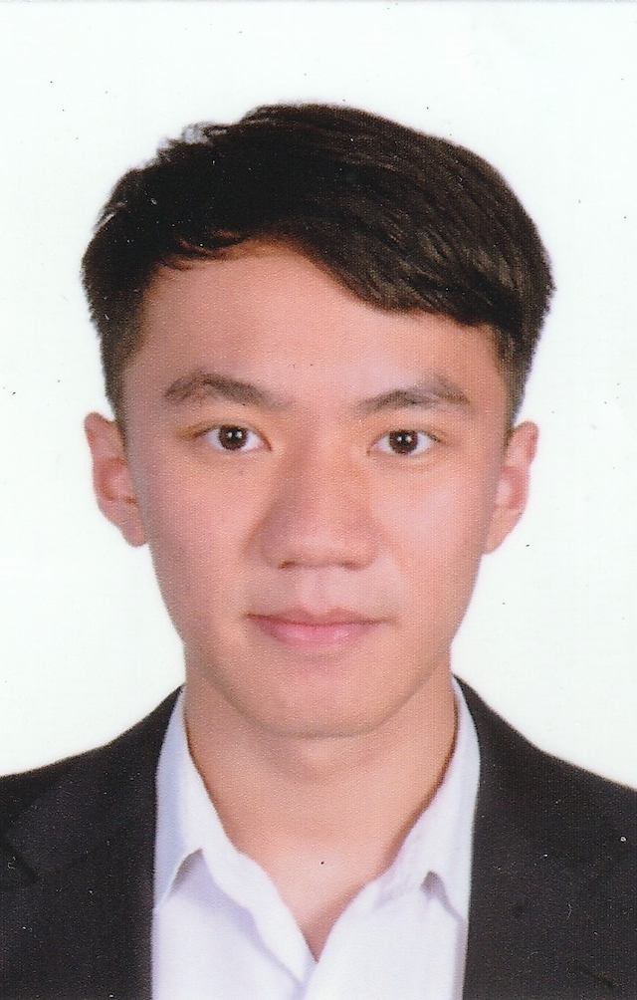

We are a team based in the [School of Computing, National University of Singapore](http://www.comp.nus.edu.sg).

You can reach us at the email `seer[at]comp.nus.edu.sg`

## Project team

### Gan Pang Yen

[[GitHub](https://github.com/pangyyen)]
[[LinkIn](https://www.linkedin.com/in/gan-pang-yen-222333227/)]

* Role: Developer
* Responsibilities: UI, Storage, Logic, Documentation, Testing

### LIM JIAN HONG

[[GitHub](http://github.com/LimJH2002)]
[[LinkedIn](https://www.linkedin.com/in/l1mjh)]

* Role: Developer
* Responsibilities: UI, Storage, Logic, Documentation, Testing

### Tan Boon Khong

[[GitHub](http://github.com/tanboonkhong)] [[LinkedIn](https://www.linkedin.com/in/boon-khong-tan-bb71491ab/)]

* Role: Developer
* Responsibilities: UI, Storage, Logic, Documentation, Testing

### Wong Li Yuan

[[Github](https://github.com/lyuanww)]
[[LinkedIn](https://www.linkedin.com/in/li-yuan-wong-4580a0266/)]

* Role: Developer
* Responsibilities: UI, Storage, Logic, Documentation, Testing

