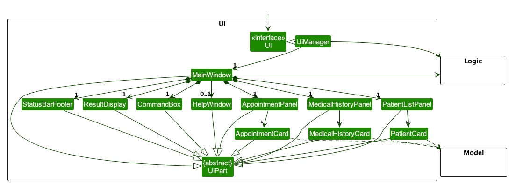

# Developer Guide for CareCentral

### Architecture

The ***Architecture Diagram*** given above explains the high-level design of the App.

Given below is a quick overview of main components and how they interact with each other.

**Main components of the architecture**

**`Main`** (consisting of classes [`Main`](https://github.com/se-edu/addressbook-level3/tree/master/src/main/java/seedu/address/Main.java) and [`MainApp`](https://github.com/se-edu/addressbook-level3/tree/master/src/main/java/seedu/address/MainApp.java)) is in charge of the app launch and shut down.
* At app launch, it initializes the other components in the correct sequence, and connects them up with each other.
* At shut down, it shuts down the other components and invokes cleanup methods where necessary.

The bulk of the app's work is done by the following four components:

* [**`UI`**](#ui-component): The UI of the App.
* [**`Logic`**](#logic-component): The command executor.
* [**`Model`**](#model-component): Holds the data of the App in memory.
* [**`Storage`**](#storage-component): Reads data from, and writes data to, the hard disk.

[**`Commons`**](#common-classes) represents a collection of classes used by multiple other components.

**How the architecture components interact with each other**

The *Sequence Diagram* below shows how the components interact with each other for the scenario where the user issues the command `delete 1`.

Each of the four main components (also shown in the diagram above),

* defines its *API* in an `interface` with the same name as the Component.
* implements its functionality using a concrete `{Component Name}Manager` class (which follows the corresponding API `interface` mentioned in the previous point.

For example, the `Logic` component defines its API in the `Logic.java` interface and implements its functionality using the `LogicManager.java` class which follows the `Logic` interface. Other components interact with a given component through its interface rather than the concrete class (reason: to prevent outside component's being coupled to the implementation of a component), as illustrated in the (partial) class diagram below.

The sections below give more details of each component.

### UI component

The **API** of this component is specified in [`Ui.java`](https://github.com/se-edu/addressbook-level3/tree/master/src/main/java/seedu/address/ui/Ui.java)

The UI consists of a `MainWindow` that is made up of parts e.g.`CommandBox`, `ResultDisplay`, `PersonListPanel`, `StatusBarFooter` etc. All these, including the `MainWindow`, inherit from the abstract `UiPart` class which captures the commonalities between classes that represent parts of the visible GUI.

The `UI` component uses the JavaFx UI framework. The layout of these UI parts are defined in matching `.fxml` files that are in the `src/main/resources/view` folder. For example, the layout of the [`MainWindow`](https://github.com/se-edu/addressbook-level3/tree/master/src/main/java/seedu/address/ui/MainWindow.java) is specified in [`MainWindow.fxml`](https://github.com/se-edu/addressbook-level3/tree/master/src/main/resources/view/MainWindow.fxml)

The `UI` component,

* executes user commands using the `Logic` component.
* listens for changes to `Model` data so that the UI can be updated with the modified data.
* keeps a reference to the `Logic` component, because the `UI` relies on the `Logic` to execute commands.
* depends on some classes in the `Model` component, as it displays `Person` object residing in the `Model`.

## Product Scope

### Target User Profile
- **Age:** 25-60 years
- **Occupation:** Healthcare professionals including doctors, nurses, and medical practitioners
- **Tech Comfort:** Regular smartphone and app user, seeks digital solutions to streamline work
- **Needs:** Efficiently manage patient records, timely appointmentEvent reminders, and a seamless referral process

### Problem Addressed

CareCentral tackles the complexities healthcare professionals face in organizing patient records, ensuring timely appointments, and coordinating referral processes. By centralizing these tasks, it promotes a more streamlined and efficient medical practice, enabling better patient care and reduced administrative burdens.

### Value Proposition

Streamline medical practice with CareCentral, designed for healthcare professionals. Seamlessly manage patient records, ensure punctual appointments, and coordinate referrals. Elevate patient care while reducing administrative tasks, all in one intuitive platform.

---
## Implementation

### Medical History
CareCentral also allows users to store and access patient medical history, including past diagnoses, allergies,
and medications. This enables healthcare professionals to provide more accurate and efficient care during patient
visits, ensuring continuity of care. User can add a `MedicalHistoryEvent` with the `Date` with format YYYY-MM-DD,
the `MedicalCondition` and the `Treatment` received by the patient.

The `MedicalHistoryEvent` will then be shown as a list of `MedicalHistoryEvent` in the `Patient`'s `Medical History`.
The MedicalHistory will be facilitated using the FilteredList, although the current implementation does not allow
filtering.

When the user starts an application, there will be an empty `CurrentMedicalHistoryEventList`. It will be populated when the
user executes `list-medical-history` command.

The `MedicalHistory` for each `Patient` will be stored in clinicbook.json as a nested attribute.

#### Note:

The difference between `MedicalHistory` class and `CurrentMedicalHistoryEventList` class is that 'MedicalHistory' is a list of
`MedicalHistoryEvent` while `MedicalHistoryEvent` is a list of `MedicalHistoryEvent` that is currently being displayed.

### \[Proposed\] Undo/redo feature

#### Proposed Implementation

The proposed undo/redo mechanism is facilitated by the `VersionedClinicBook` class. The `VersionedClinicBook` class extends `ClinicBook` with an undo/redo history, stored internally as `clinicBookStateList` and `currentStatePointer`. Additionally, it implementes the following operations:

* `VersionedClinicBook#commit()` — Saves the current address book state in its history.
* `VersionedClinicBook#undo()` — Restores the previous address book state from its history.
* `VersionedClinicBook#redo()` — Restores a previously undone address book state from its history.

These operations are exposed in the `Model` interface as `Model#commitAddressBook()`, `Model#undoAddressBook()` and `Model#redoAddressBook()` respectively.

### \[Proposed\] Pharmacy Integration

#### Proposed Implementation

The proposed pharmacy integration is facilitated by the `Pharmacy` class. The `Pharmacy` class extends `ClinicBook` with a list of `Medicine` and `Prescription` that is stored internally as `medicineList` and `prescriptionList`. Additionally, it implementes the following operations:

* `Pharmacy#addMedicine()` — Adds a `Medicine` to the `medicineList`.
* `Pharmacy#deleteMedicine()` — Deletes a `Medicine` from the `medicineList`.
* `Pharmacy#addPrescription()` — Adds a `Prescription` to the `prescriptionList`.
* `Pharmacy#deletePrescription()` — Deletes a `Prescription` from the `prescriptionList`.
* `Pharmacy#findMedicine()` — Finds a `Medicine` from the `medicineList`.
* `Pharmacy#listMedicine()` — Lists all `Medicine` from the `medicineList`.
* `Pharmacy#listPrescription()` — Lists all `Prescription` from the `prescriptionList`.
* `Pharmacy#updateMedicine()` — Updates a `Medicine` from the `medicineList`.
* `Pharmacy#updatePrescription()` — Updates a `Prescription` from the `prescriptionList`.

Given below is the UML diagram for the `Pharmacy` class.

## User Stories

### Doctor

- As a doctor (Age: 30-60), I can easily create, access, and edit patient records on my smartphone app to provide accurate and efficient care during patient visits.
- As a doctor, I can share and edit surgical notes and post-operative care instructions with my patients through the app, ensuring they have all the necessary information.
- As a doctor, I can securely store patient therapy notes in the app, ensuring confidentiality and continuity of care.
- As a doctor (Age: 30-60), I want to schedule, reschedule, and cancel appointments on the app to manage my day-to-day practice schedule efficiently and reduce no-shows.
- As a doctor (Age: 30-60), I can send a patient referral to a specialist using the app so that the referred professional has immediate access to necessary patient data, ensuring smooth continuation of care.
- As a doctor (Age: 30-60), I want to prescribe medications directly through the app, so that pharmacies can promptly prepare medicines and patients receive timely notifications.
- As a doctor (Age: 30-60), I can view patient feedback and reviews about their visit, enabling me to continuously improve my service and better meet their needs.

## Use Cases

### Must Have

1. **Create New Patient Records**
   - **MSS (Main Success Scenario):**
      1. Doctor chooses to create a new patient record.
      2. App prompts for the patient's details.
      3. Doctor enters the required information.
      4. App saves the new patient record.
      5. Doctor views the updated list of patient records.

2. **View All Existing Patient Records**
   - **MSS:**
      1. Doctor chooses to view all patient records.
      2. App displays the list of all patient records.
3. **View One Patient Record**
   - **MSS:**
      1. Doctor searches for a specific patient record.
      2. App displays the patient's record.

4. **Delete Patient Record**
   - **MSS:**
      1. Doctor selects a patient record to delete.
      2. App deletes the selected record.
      3. Doctor views the updated list of patient records.

### Nice to Have

1. **Delete Confirmation**
   - **MSS:**
      1. Doctor selects a patient record to delete.
      2. App prompts for confirmation.
      3. Doctor confirms the deletion.
      4. App deletes the selected record.

2. **View All Appointments**
   - **MSS:**
      1. Doctor chooses to view all appointments.
      2. App displays the list of all appointments.

3. **Edit Patient Record/Appointment**
   - **MSS:**
      1. Doctor selects a patient record or appointmentEvent to edit.
      2. App prompts for the new information.
      3. Doctor enters the updated information.
      4. App saves the changes.

### Luxury to Have

1. **Share Patient Record**
   - **MSS:**
      1. Doctor selects a patient record to share.
      2. App prompts for the recipient's details.
      3. Doctor enters the recipient's information.
      4. App shares the selected record with the recipient.

2. **Prescribe Medications**
   - **MSS:**
      1. Doctor selects a patient to prescribe medication.
      2. App prompts for the medication details.
      3. Doctor enters the required information.
      4. App sends the prescription to the pharmacy and notifies the patient.

3. **Refer to Specialist**
   - **MSS:**
      1. Doctor selects a patient to refer to a specialist.
      2. App prompts for the specialist's and patient's details.
      3. Doctor enters the required information.
      4. App sends the referral to the specialist.

4. **View Feedback and Reviews**
   - **MSS:**
      1. Doctor chooses to view feedback and reviews.
      2. App displays the list of all feedback and reviews.

## Non-Functional Requirements

1. **Performance Requirements:** The app should be able to handle up to 500 patient records without significant performance degradation.
2. **Security Requirements:** All patient data must be stored securely to ensure confidentiality and privacy.
3. **Usability Requirements:** The app should be user-friendly, with a clean and intuitive CLI interface that can be easily navigated by healthcare professionals.
4. **Compatibility Requirements:** The app should be compatible with both iOS and Android devices, ensuring accessibility for a wide range of users.

### Glossary

- **App:** Refers to the CareCentral application.
- **Healthcare Professional:** A user who is a certified medical practitioner, including doctors, nurses,
- and other medical staff.
- **Patient Record:** A digital file within the app containing all relevant information about a patient, including
- medical history, prescriptions, and appointmentEvent records.
- **User:** Refers to the healthcare professionals using the CareCentral app.
