* Table of Contents
  {:toc}

--------------------------------------------------------------------------------------------------------------------
## **Design**

### Architecture

The ***Architecture Diagram*** given above explains the high-level design of the App.

Given below is a quick overview of main components and how they interact with each other.

**Main components of the architecture**

**`Main`** (consisting of
classes [`Main`](https://github.com/AY2324S1-CS2103T-F08-1/tp/blob/master/src/main/java/seedu/cc/Main.java)
and [`MainApp`](https://github.com/AY2324S1-CS2103T-F08-1/tp/blob/master/src/main/java/seedu/cc/MainApp.java)) is in
charge of the app launch and shut down.

* At app launch, it initializes the other components in the correct sequence, and connects them up with each other.
* At shut down, it shuts down the other components and invokes cleanup methods where necessary.

The bulk of the app's work is done by the following four components:

* [**`UI`**](#ui-component): The UI of the App.
* [**`Logic`**](#logic-component): The command executor.
* [**`Model`**](#model-component): Holds the data of the App in memory.
* [**`Storage`**](#storage-component): Reads data from, and writes data to, the hard disk.

[**`Commons`**](#common-classes) represents a collection of classes used by multiple other components.

**How the architecture components interact with each other**

**The *Sequence Diagram* below shows how the components interact with each other for the scenario where the user issues the command `delete-p 1`.**

Each of the four main components (also shown in the diagram above),

* defines its *API* in an `interface` with the same name as the Component.
* implements its functionality using a concrete `{Component Name}Manager` class (which follows the corresponding
  API `interface` mentioned in the previous point.

For example, the `Logic` component defines its API in the `Logic.java` interface and implements its functionality using
the `LogicManager.java` class which follows the `Logic` interface. Other components interact with a given component
through its interface rather than the concrete class (reason: to prevent outside component's being coupled to the
implementation of a component), as illustrated in the (partial) class diagram below.

The sections below give more details of each component.

### UI component

The **API** of this component is specified
in [`Ui.java`](https://github.com/AY2324S1-CS2103T-F08-1/tp/blob/master/src/main/java/seedu/cc/ui/Ui.java)

The UI consists of a `MainWindow` that is made up of parts
e.g.`CommandBox`, `ResultDisplay`, `PatientListPanel`, `StatusBarFooter` etc. All these, including the `MainWindow`,
inherit from the abstract `UiPart` class which captures the commonalities between classes that represent parts of the
visible GUI.

The `UI` component uses the JavaFx UI framework. The layout of these UI parts are defined in matching `.fxml` files that
are in the `src/main/resources/view` folder. For example, the layout of
the [`MainWindow`](https://github.com/AY2324S1-CS2103T-F08-1/tp/blob/master/src/main/java/seedu/cc/ui/MainWindow.java)
is specified
in [`MainWindow.fxml`](https://github.com/AY2324S1-CS2103T-F08-1/tp/blob/master/src/main/resources/view/MainWindow.fxml)

The `UI` component,

* executes user commands using the `Logic` component.
* listens for changes to `Model` data so that the UI can be updated with the modified data.
* keeps a reference to the `Logic` component, because the `UI` relies on the `Logic` to execute commands.
* depends on some classes in the `Model` component, as it displays `Patient` object residing in the `Model`.

### Logic component

**API** : [`Logic.java`](https://github.com/AY2324S1-CS2103T-F08-1/tp/blob/master/src/main/java/seedu/cc/logic/Logic.java)

Here's a (partial) class diagram of the `Logic` component:

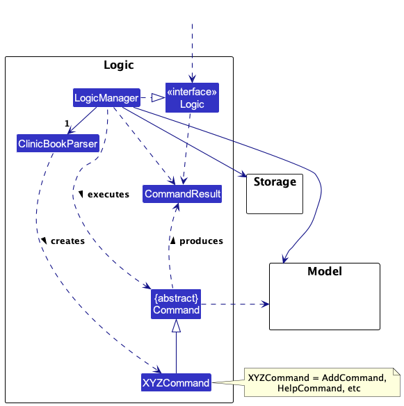

The sequence diagram below illustrates the interactions within the `Logic` component, taking `execute("delete 1")` API
call as an example.

:information_source: **Note:** The lifeline for `DeleteCommandParser` should end at the destroy marker (X) but due to a limitation of PlantUML, the lifeline reaches the end of diagram.

How the `Logic` component works:

1. When `Logic` is called upon to execute a command, it is passed to an `ClinicBookParser` object which in turn creates
   a parser that matches the command (e.g., `DeleteCommandParser`) and uses it to parse the command.
1. This results in a `Command` object (more precisely, an object of one of its subclasses e.g., `DeleteCommand`) which
   is executed by the `LogicManager`.
1. The command can communicate with the `Model` when it is executed (e.g. to delete a person).
1. The result of the command execution is encapsulated as a `CommandResult` object which is returned back from `Logic`.

Here are the other classes in `Logic` (omitted from the class diagram above) that are used for parsing a user command:

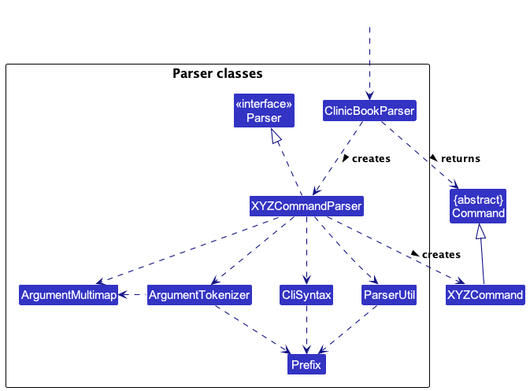

How the parsing works:

* When called upon to parse a user command, the `ClinicBookParser` class creates an `XYZCommandParser` (`XYZ` is a
  placeholder for the specific command name e.g., `AddCommandParser`) which uses the other classes shown above to parse
  the user command and create a `XYZCommand` object (e.g., `AddCommand`) which the `ClinicBookParser` returns back as
  a `Command` object.
* All `XYZCommandParser` classes (e.g., `AddCommandParser`, `DeleteCommandParser`, ...) inherit from the `Parser`
  interface so that they can be treated similarly where possible e.g, during testing.

### Model component

**API
** : [`Model.java`](https://github.com/AY2324S1-CS2103T-F08-1/tp/blob/master/src/main/java/seedu/cc/model/Model.java)

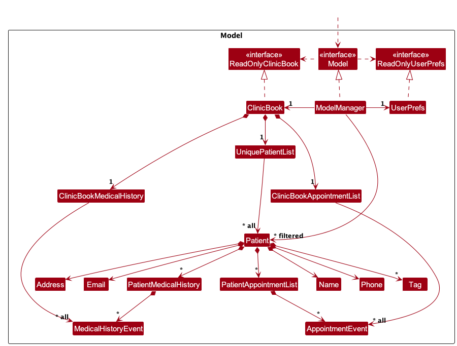

The `Model` component,

* stores the clinic book data i.e., all `Patient` objects (which are contained in a `UniquePatientList` object).
* stores the currently 'selected' `Patient` objects (e.g., results of a search query) as a separate _filtered_ list
  which is exposed to outsiders as an unmodifiable `ObservableList<Patient>` that can be 'observed' e.g. the UI can be
  bound to this list so that the UI automatically updates when the data in the list change.
* stores a `UserPref` object that represents the user’s preferences. This is exposed to the outside as
  a `ReadOnlyUserPref` objects.
* does not depend on any of the other three components (as the `Model` represents data entities of the domain, they
  should make sense on their own without depending on other components)

### Storage component

**API
** : [`Storage.java`](https://github.com/AY2324S1-CS2103T-F08-1/tp/blob/master/src/main/java/seedu/cc/storage/Storage.java)

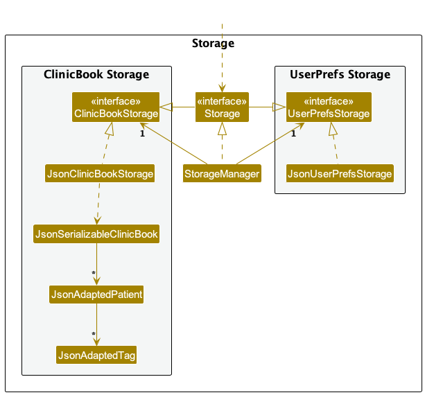

The `Storage` component,

* can save both clinic book data and user preference data in JSON format, and read them back into corresponding
  objects.
* inherits from both `ClinicBookStorage` and `UserPrefStorage`, which means it can be treated as either one (if only
  the functionality of only one is needed).
* depends on some classes in the `Model` component (because the `Storage` component's job is to save/retrieve objects
  that belong to the `Model`)

### Common classes

Classes used by multiple components are in the `seedu.cc.commons` package.]

--------------------------------------------------------------------------------------------------------------------

## **Implementation**

### Patient

A `Patient` has the following fields:

* Each `Patient` has a unique combination of `Name`, `Age`, `Nric`, `Email` and `Phone`
* Each `Patient` has a `MedicalHistory`.
* Each `Patient` has a `PatientAppointmentList`.
* Each class has their respective getter methods

The class diagram below is an overview of the `Patient` class.
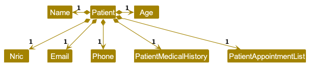

#### Implementation of Patient Commands

Commands related to `Patient`:
- `AddCommand` - Adds a `Patient` to the `ClinicBook`.
- `DeleteCommand` - Deletes a `Patient` from the `ClinicBook`.
- `EditCommand` - Edits a `Patient` in the `ClinicBook`.
- `FindCommand` - Finds a `Patient` in the `ClinicBook`.
- `ListCommand` - Lists all `Patient` in the `ClinicBook`.

All the commands above are parsed by the `ClinicBookParser` and then by the corresponding parsers (i.e. `AddCommandParser`,
`DeleteCommandParser` etc.) After which, the command (i.e. `AddCommand`, `DeleteCommand`) will be executed.

### Medical History

User can add a `MedicalHistoryEvent` with the `Date` with format YYYY-MM-DD,
the `MedicalCondition` and the `Treatment` received by the patient.

The `MedicalHistoryEvent` will then be shown as a list of `MedicalHistoryEvent` in the `Patient`'
s `PatientMedicalHistory`.
The MedicalHistory will be facilitated using the FilteredList, although the current implementation does not allow
filtering.

When the user starts an application, there will be an empty `ClinicBookMedicalHistory`. It will be populated when the
user executes `list-medical-history` command.

The `PatientMedicalHistory` for each `Patient` will be stored in clinicbook.json as a nested attribute.

The difference between `PatientMedicalHistory` class and `ClinicBookMedicalHistory` class is
that `PatientMedicalHistory` is a list of
`MedicalHistoryEvent` while `ClinicBookMedicalHistory` is a list of `MedicalHistoryEvent` that is currently being
displayed.

Commands related to `MedicalHistoryEvent`:
- `AddMedicalHistoryEventCommand` - Adds a `MedicalHistoryEvent` to a `Patient`.
- `DeleteMedicalHistoryEventCommand` - Deletes a `MedicalHistoryEvent` of a `Patient`.
- `EditMedicalHistoryEventCommand` - Edits a `MedicalHistoryEvent` of a `Patient`.
- `ListMedicalHistoryEventCommand` - Lists all `MedicalHistoryEvent` of a `Patient`.

**An example usage scenario and how the medical history mechanism behaves at each step is shown below.**

1. The user launches the application for the first time. `ClinicBookMedicalHistory` contains no default list
of `MedicalHistoryEvent`. 
2. The user inputs `list-medical-history` to list all medical history. `Ui` passes the input to `Logic`. `Logic` then uses a
few `Parser` classes to extract layers of information out as seen from steps 3 to 5.
3. `Logic` passes the user input to `ClinicBookParser`. `ClinicBookParser` identifies that this is
a `ListMedicalHistoryEventCommand` through the word "list-md". It then creates a `ListMedicalHistoryEventCommandParser`
to parse it into a `ListMedicalHistoryEventCommand` and return. 
4. Logic finally gets the `ListMedicalHistoryEventCommand` and execute it. The execution firstly
calls `Model#getFilteredPatientList()` to get the patients that are currently being displayed. It then gets
the `Patient` from the list using the index provided by the user.
It then calls `Model#listMedicalHistoryEvents(Patient patient)` to set `ClinicBookMedicalHistory` as the list
of `MedicalHistoryEvent` that belongs to the patient.
This execution then returns a `CommandResult` to `Ui`, containing the response to the user. 
5. UI displays the response in the CommandResult. In addition, UI will change to display the list
of `MedicalHistoryEvent` after model updates `filteredMedicalHistoryEvents`, since `Ui` is constantly listening for the
change in `Model`.

**The Sequence Diagram below shows how the components interact with each other for the above mentioned scenario**

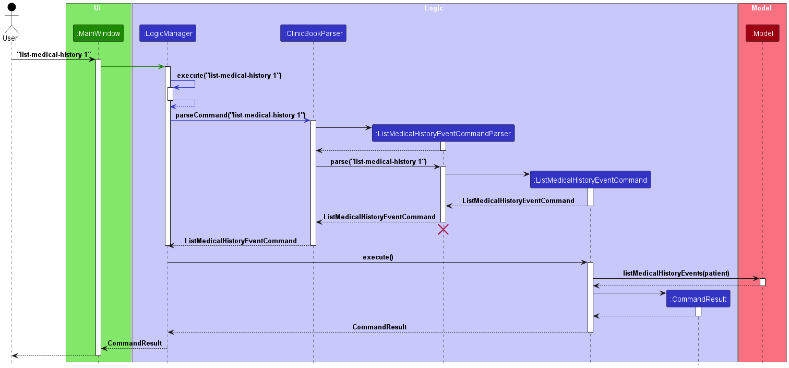

### Appointment

The appointment-related features are facilitated by the `appointment` package. The `appointment` package
includes `AppointmentEvent`, `PatientAppointmentList` and `ClinicBookAppointmentList`.

The `PatientAppointmentList` is an attribute for each `Patient` and stores a list of `AppointmentEvent`; and the attribute will be stored in `clinicbook.json`
The `ClinicBookAppointmentList` is a list of `AppointmentEvent` that is used for display purposes.

When the user starts an application, there will be an empty `ClinicBookCLinicBookAppointment`. It will be populated when the
user executes `list-appointments` command.

Commands related to `AppointmentEvent`:
- `AddAppointmentEventCommand` - Adds a `AppointmentEvent` to a `Patient`.
- `DeleteAppointmentEventCommand` - Deletes a `AppointmentEvent` of a `Patient`.
- `EditAppointmentEventCommand` - Edits a `AppointmentEvent` of a `Patient`.
- `ListAppointmentEventsCommand` - Lists all `AppointmentEvent` of a `Patient`.

**An example usage scenario and how the appointment event mechanism behaves at each step is shown below.**
1. The sequence starts with a user inputting the command "list-appointments 1" into the application's main user interface (UI), specifically in the `MainWindow`.
2. This input is then passed from the `MainWindow` to the `LogicManager`.
3. The LogicManager forwards the command string to the ClinicBookParser for parsing. The ClinicBookParser identifies the
   command as an ListAppointmentEventsCommand and creates an ListAppointmentEventsCommandParser, which parses the details of the command
   and creates an `ListAppointmentEventsCommand` object.
4. The `LogicManager` then calls the `execute` method on the `ListAppointmentEventsCommand` object.
5. The `ListAppointmentEventsCommand` then interacts with the `Model` to retrieve the list of `AppointmentEvent` of the `Patient`.
   The `Model` then returns the list of `AppointmentEvent` to the `ListAppointmentEventsCommand`.
6. After retrieving the list of `AppointmentEvent`, the `ListAppointmentEventsCommand` returns a `CommandResult` object to the `LogicManager`, which
   then returns the `CommandResult` object to the `MainWindow` for display to the user.

**The sequence diagram below illustrates the interactions of the components for the scenario where the user issues the command `list-appointments`**

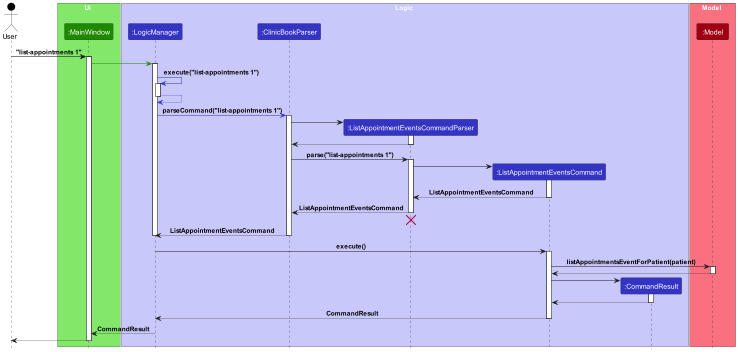

### Prescription 

The prescription-related features are facilitated by the `Prescription` class. The `Prescription` class is included in the `appointment` package.

The set of `Prescription` class is an attribute for each `AppointmentEvent`, each `Prescription` contains one Medicine name and the attribute will be stored in `clinicbook.json`. 

Each `Prescription` is associated with a `AppointmentEvent` and the `Prescription` will be shown as a list of `Prescription` in the `AppointmentEvent`.

Commands related to `Prescription`:
- `AddPrescriptionCommand` - Adds `Prescription` of an `AppointmentEvent` of a `Patient`.
- `DeletePrescriptionCommand` - Deletes `Prescription` of an `AppointmentEvent` of a `Patient`.
- `EditPrescriptionCommand` - Edits the `Prescription` of an `AppointmentEvent` of a `Patient`.

**An example usage scenario and how the prescription mechanism behaves at each step is shown below.**
1. The process begins with the user inputting a command to add a prescription ("add-prescription 1 pi/1 mn/Panadol") into the system main window.
2. This input is then passed from the `MainWindow` to the `LogicManager`.
3. The LogicManager forwards the command string to the ClinicBookParser for parsing. The ClinicBookParser identifies the
command as an AddPrescriptionCommand and creates an AddPrescriptionCommandParser, which parses the details of the command
and creates an `AddPrescriptionCommand` object.
4. The `LogicManager` then calls the `execute` method on the `AddPrescriptionCommand` object, which interacts with an 
`AppointmentEvent` object, and encapsulates the details of the patient's appointment and prescription to be added.
5. The `AddPrescriptionCommand` then interacts with the `Model` to update the patient's appointment with the new prescription.
6. After updating the model, the `AddPrescriptionCommand` returns a `CommandResult` object to the `LogicManager`, which
then returns the `CommandResult` object to the `MainWindow` for display to the user.

**The sequence diagram below illustrates the interactions of the components for the scenario where the user issues the command `add-prescription`**

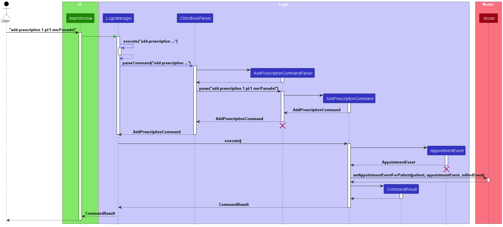

### \[Proposed\] Undo/redo feature

#### Proposed Implementation

The proposed undo/redo mechanism is facilitated by the `VersionedClinicBook` class. The `VersionedClinicBook` class
extends `ClinicBook` with an undo/redo history, stored internally as `clinicBookStateList` and `currentStatePointer`.
Additionally, it implementes the following operations:

* `VersionedClinicBook#commit()` — Saves the current clinic book state in its history.
* `VersionedClinicBook#undo()` — Restores the previous clinic book state from its history.
* `VersionedClinicBook#redo()` — Restores a previously undone clinic book state from its history.

These operations are exposed in the `Model` interface as `Model#commitClinicBook()`, `Model#undoClinicBook()`
and `Model#redoClinicBook()` respectively.

Given below is an example usage scenario and how the undo/redo mechanism behaves at each step.

Step 1. The user launches the application for the first time. The `VersionedClinicBook` will be initialized with the initial clinic book state, and the `currentStatePointer` pointing to that single clinic book state.

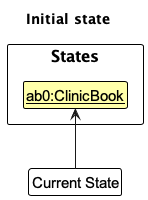

Step 2. The user executes `delete 5` command to delete the 5th patient in the clinic book. The `delete` command calls `Model#commitClinicBook()`, causing the modified state of the clinic book after the `delete 5` command executes to be saved in the `clinicBookStateList`, and the `currentStatePointer` is shifted to the newly inserted clinic book state.

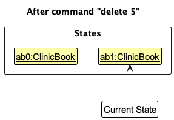

Step 3. The user executes `add n/David …​` to add a new patient. The `add` command also calls `Model#commitClinicBook()`, causing another modified clinic book state to be saved into the `clinicBookStateList`.

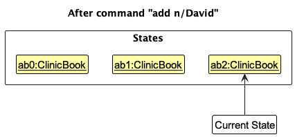

:information_source: **Note:** If a command fails its execution, it will not call `Model#commitClinicBook()`, so the clinic book state will not be saved into the `clinicBookStateList`.

Step 4. The user now decides that adding the patient was a mistake, and decides to undo that action by executing the `undo` command. The `undo` command will call `Model#undoClinicBook()`, which will shift the `currentStatePointer` once to the left, pointing it to the previous clinic book state, and restores the clinic book to that state.

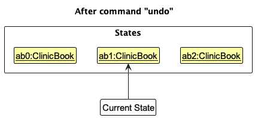

:information_source: **Note:** If the `currentStatePointer` is at index 0, pointing to the initial ClinicBook state, then there are no previous ClinicBook states to restore. The `undo` command uses `Model#canUndoClinicBook()` to check if this is the case. If so, it will return an error to the user rather
than attempting to perform the undo.

The following sequence diagram shows how the undo operation works:

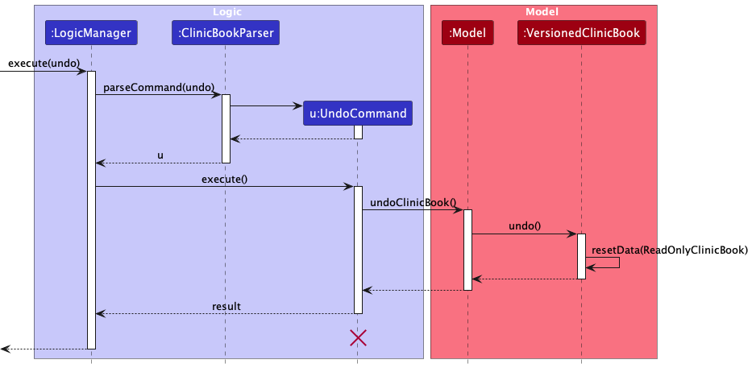

:information_source: **Note:** The lifeline for `UndoCommand` should end at the destroy marker (X) but due to a limitation of PlantUML, the lifeline reaches the end of diagram.

The `redo` command does the opposite — it calls `Model#redoClinicBook()`, which shifts the `currentStatePointer` once to the right, pointing to the previously undone state, and restores the clinic book to that state.

:information_source: **Note:** If the `currentStatePointer` is at index `clinicBookStateList.size() - 1`, pointing to the latest clinic book state, then there are no undone ClinicBook states to restore. The `redo` command uses `Model#canRedoClinicBook()` to check if this is the case. If so, it will return an error to the user rather than attempting to perform the redo.

Step 5. The user then decides to execute the command `list`. Commands that do not modify the clinic book, such as `list`, will usually not call `Model#commitClinicBook()`, `Model#undoClinicBook()` or `Model#redoClinicBook()`. Thus, the `clinicBookStateList` remains unchanged.

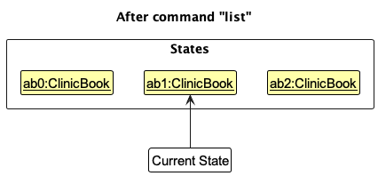

Step 6. The user executes `clear`, which calls `Model#commitClinicBook()`. Since the `currentStatePointer` is not pointing at the end of the `clinicBookStateList`, all clinic book states after the `currentStatePointer` will be purged. Reason: It no longer makes sense to redo the `add n/David …​` command. This is the behavior that most modern desktop applications follow.

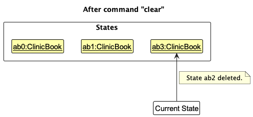

The following activity diagram summarizes what happens when a user executes a new command:

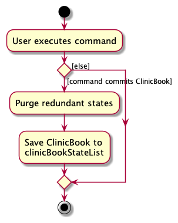

### \[Proposed\] Pharmacy Integration

#### Proposed Implementation

The proposed pharmacy integration is facilitated by the `Pharmacy` class. The `Pharmacy` class extends `ClinicBook` with
a list of `Medicine` and `Prescription` that is stored internally as `medicineList` and `prescriptionList`.
Additionally, it implementes the following operations:

* `Pharmacy#addMedicine()` — Adds a `Medicine` to the `medicineList`.
* `Pharmacy#deleteMedicine()` — Deletes a `Medicine` from the `medicineList`.
* `Pharmacy#addPrescription()` — Adds a `Prescription` to the `prescriptionList`.
* `Pharmacy#deletePrescription()` — Deletes a `Prescription` from the `prescriptionList`.
* `Pharmacy#findMedicine()` — Finds a `Medicine` from the `medicineList`.
* `Pharmacy#listMedicine()` — Lists all `Medicine` from the `medicineList`.
* `Pharmacy#listPrescription()` — Lists all `Prescription` from the `prescriptionList`.
* `Pharmacy#updateMedicine()` — Updates a `Medicine` from the `medicineList`.
* `Pharmacy#updatePrescription()` — Updates a `Prescription` from the `prescriptionList`.

--------------------------------------------------------------------------------------------------------------------

## **Documentation, logging, testing, configuration, dev-ops**

- [Documentation guide](Documentation.md)
- [Testing guide](Testing.md)
- [Logging guide](Logging.md)
- [Configuration guide](Configuration.md)
- [DevOps guide](DevOps.md)

---

## **Appendix: Requirements**

### Product scope

**Target user profile**:

- medical administrators who need to oversee the operations of a clinic who has a substantial number of patients
- favor desktop applications over other platforms
- prefer a CLI-based interface over a GUI-based interface
- are comfortable typing commands

**Value proposition**: The app helps the user to manage patient records, medical histories and appointments.

### User Stories

Priorities: High (must have) - `* * *`, Medium (nice to have) - `* *`, Low (unlikely to have) - `*`

| Priority | As a …                | I can …                             | To fulfill …                                        |
|----------|-----------------------|-------------------------------------|-----------------------------------------------------|
| `* * *`  | medical administrator | add a patient record                | Efficiently maintain patient records                |
| `* * *`  | medical administrator | list all patients                   | Easily view the complete patient list               |
| `* * *`  | medical administrator | edit a patient record               | Keep patients' information up to date               |
| `* * *`  | medical administrator | delete a patient record             | Remove patients who are no longer under care        |
| `* *`    | medical administrator | give patients different priorities  | Prioritize patient care effectively                 |
| `* `     | medical administrator | list patients by priority           | Quickly access patients based on priority           |
| `* * *`  | medical administrator | add an appointment                  | Schedule appointments for patients                  |
| `* * *`  | medical administrator | list all appointments of a patient  | Access a patient's complete appointment history     |
| `* * *`  | medical administrator | edit an appointment                 | Modify appointment details as needed                |
| `* * *`  | medical administrator | delete an appointment               | Eliminate unnecessary appointments                  |
| `*`      | medical administrator | cancel an appointment               | Efficiently manage appointment cancellations        |
| `* *`    | medical administrator | sort appointments by date           | Easily view appointments in chronological order     |
| `* `     | medical administrator | mark an appointment as missed       | Record the status of missed appointments            |
| `*`      | medical administrator | mark an appointment as attended     | Record the status of attended appointments          |
| `* * `   | medical administrator | add prescriptions to an appointment | Easily document prescribed medications for patients |
| `* * *`  | medical administrator | add a medical history               | Keep comprehensive medical histories for patients   |
| `* * *`  | medical administrator | list a patient's medical history    | Access and review patient medical histories         |
| `* * *`  | medical administrator | edit a medical history              | Update patient medical histories as necessary       |
| `* * *`  | medical administrator | delete a medical history            | Remove outdated or irrelevant medical histories     |
| `* * *`  | medical administrator | find a patient                      | Quickly locate specific patients                    |
| `* *`    | medical administrator | find an appointment                 | Easily search for specific appointments             |
| `* * `   | medical administrator | find a medical history              | Quickly retrieve specific patient medical histories |
| `*`      | medical administrator | undo previous action                | Correct any inadvertent actions                     |
| `*`      | medical administrator | redo previous action                | Reapply actions that were previously undone         |
| `* * *`  | medical administrator | exit the app                        | Close the application with ease                     |
| `* * *`  | medical administrator | get help                            | Access a list of available commands and assistance  |

### Use Cases

#### Use case: UG01 - Create Patient Record

**Actor:** Medical Staff

**MSS**

1. User issues the command to add a new patient record with the required details.
2. System adds the new patient record.
3. System displays a success message along with the details of the added patient.

   Use case ends.

**Extensions**

* 2a. The input details are invalid.
    * 2a1. System shows an error message.

      Use case ends.

#### Use case: UG02 - List Patients

**Actor:** Medical Staff

**MSS**

1. User requests to list all patients.
2. System retrieves and shows a list of patients.

   Use case ends.

**Extensions**

* 2a. The list is empty.
    * 2a1. System informs the user that the list is empty.

      Use case ends.

#### Use case: UG03 - Edit Patient Record

**Actor:** Medical Staff

**MSS**

1. User requests to edit a specific patient record using the patient's index in the list and provides the new details.
2. System validates the input details.
3. System updates the patient record with the new details.
4. System displays a success message along with the updated details of the patient.

   Use case ends.

**Extensions**

* 2a. The given index or details is invalid.
    * 2a1. System shows an error message with the correct input format.

      Use case ends.

#### Use case: UG04 - Delete Patient Record

**Actor:** Medical Staff

**MSS**

1. User requests to delete a specific patient record using the patient's index in the list.
2. System deletes the patient record.
3. System displays a success message.

   Use case ends.

**Extensions**

* 1a. The given index is invalid.
    * 1a1. System shows an error message.

      Use case ends.

#### Use case: UG05 - Add Appointment

**Actor:** Medical Staff

**MSS**

1. User issues the command to schedule a new appointment for a patient using the patient's index and provides the
   appointment details.
2. System validates the input details.
3. System adds the new appointment.
4. System displays a success message along with the details of the added appointment.

   Use case ends.

**Extensions**

* 2a. The input details are invalid.
    * 2a1. System shows an error message.

      Use case ends.

#### Use case: UG06 - List All Appointments

**Actor:** Medical Staff

**MSS**

1. User requests to list all appointments.
2. System retrieves and shows a list of appointments.

   Use case ends.

**Extensions**

* 2a. The list is empty.
    * 2a1. System informs the user that there are no appointments.

      Use case ends.

#### Use case: UG07 - Edit Appointment

**Actor:** Medical Staff

**MSS**

1. User requests to edit a specific appointment using the appointment's index in the list and provides the new details.
2. System validates the input details.
3. System updates the appointment with the new details.
4. System displays a success message along with the updated details of the appointment.

   Use case ends.

**Extensions**

* 2a. The given index is invalid.
    * 2a1. System shows an error message.

      Use case ends.

* 2b. The input details are invalid.
    * 2b1. System shows an error message.

      Use case ends.

#### Use case: UG08 - Delete Appointment

**Actor:** Medical Staff

**MSS**

1. User requests to delete a specific appointment using the appointment's index in the list.
2. System deletes the appointment.
3. System displays a success message.

   Use case ends.

**Extensions**

* 1a. The given index is invalid.
    * 1a1. System shows an error message.

      Use case ends.

#### Use case: UG09 - Add Medical History

**Actor:** Medical Staff

**MSS**

1. User issues the command to add a medical history for a patient using the patient's index and provides the medical
   history details.
2. System validates the input details.
3. System adds the medical history to the patient's record.
4. System displays a success message along with the details of the added medical history.

   Use case ends.

**Extensions**

* 2a. The input details are invalid.
    * 2a1. System shows an error message.

      Use case ends.

#### Use case: UG10 - List Medical History

**Actor:** Medical Staff

**MSS**

1. User requests to list the medical history of a specific patient using the patient's index.
2. System retrieves and shows the medical history of the patient.

   Use case ends.

**Extensions**

* 2a. The given index is invalid.
    * 2a1. System shows an error message.

      Use case ends.

* 2b. There is no medical history for the selected patient.
    * 2b1. System informs the user that there is no medical history for the selected patient.

      Use case ends.

#### Use case: UG11 - Edit Medical History

**Actor:** Medical Staff

**MSS**

1. User requests to edit a specific medical history record using the medical history's index and the patient's index,
   and provides the new details.
2. System validates the input details.
3. System updates the medical history record with the new details.
4. System displays a success message along with the updated details of the medical history.

   Use case ends.

**Extensions**

* 2a. The given indexes are invalid.
    * 2a1. System shows an error message.

      Use case ends.

* 2b. The input details are invalid.
    * 2b1. System shows an error message.

      Use case ends.

#### Use case: UG12 - Delete Medical History

**Actor:** Medical Staff

**MSS**

1. User requests to delete a specific medical history record using the medical history's index and the patient's index.
2. System deletes the medical history record.
3. System displays a success message.

   Use case ends.

**Extensions**

* 1a. The given indexes are invalid.
    * 1a1. System shows an error message.

      Use case ends.

Certainly! Below are the use cases created from the user stories:

#### Use case: UC13 - Find Patient by Name

**Actor:** Medical Staff

**MSS**

1. Medical Staff requests to find a patient using the patient's name.
2. System searches for the patient and displays the relevant patient records.
3. Medical Staff views the patient’s information.

   Use case ends.

**Extensions**

* 2a. No patient record matches the given name.
    * 2a1. System informs the Medical Staff that no matching record was found.

      Use case ends.

#### Use case: UC14 - Clear All Listed Patients

**Actor:** Medical Staff

**MSS**

1. Medical Staff selects the option to clear all listed patients.
2. System removes all patient records from the current view.
3. Medical Staff views the cleared list.

   Use case ends.

#### Use case: UC15 - Switch Between Different Tabs

**Actor:** Medical Staff

**MSS**

1. Medical Staff selects the tab they wish to view (patient details, medical history, or appointments).
2. System displays the content of the selected tab.

   Use case ends.

#### Use case: UC16 - Access Help Page

**Actor:** Medical Staff

**MSS**

1. Medical Staff selects the option to view the help page.
2. System displays the help page with guidance on how to use the application.
3. Medical Staff views and interacts with the help page as needed.

   Use case ends.

#### Use case: UC17 - Exit Application

**Actor:** Medical Staff

**MSS**

1. Medical Staff chooses the option to exit the application.
2. System securely closes the application.

   Use case ends.

### Non-Functional Requirements

1. **Performance Requirements:** The app should be able to handle up to 500 patient records without significant
   performance degradation.
2. **Security Requirements:** All patient data must be stored securely to ensure confidentiality and privacy.
3. **Usability Requirements:** The app should be user-friendly, with a clean and intuitive CLI interface that can be
   easily navigated by healthcare professionals.
4. **Compatibility Requirements:** The app should be compatible with both iOS and Android devices, ensuring
   accessibility for a wide range of users.

### Glossary

- **App:** Refers to the CareCentral application.
- **Healthcare Professional:** A user who is a certified medical practitioner, including doctors, nurses,
- and other medical staff.
- **Patient Record:** A digital file within the app containing all relevant information about a patient, including
- medical history, prescriptions, and appointmentEvent records.
- **User:** Refers to the healthcare professionals using the CareCentral app.

---

## **Appendix: Instructions for manual testing**

Given below are instructions to test the app manually.

:information_source: **Note:** These instructions only provide a starting point for testers to work on;
testers are expected to do more *exploratory* testing.

### Launch and shutdown

1. Initial launch

    1. Download the jar file and copy into an empty folder

    2. Double-click the jar file Expected: Shows the GUI with a set of sample contacts. The window size may not be optimum.

2. Saving window preferences

    1. Resize the window to an optimum size. Move the window to a different location. Close the window.

    2. Re-launch the app by double-clicking the jar file. 
       Expected: The most recent window size and location is retained.

### Deleting a patient

1. Deleting a patient while all patients are being shown

    1. Prerequisites: List all patients using the `list-patients` command. Multiple patients in the list.

    2. Test case: `delete-patient 1` 
       Expected: First contact is deleted from the list. Details of the deleted contact shown in the status message. Timestamp in the status bar is updated.

    3. Test case: `delete-patient 1` 
       Expected: No patient is deleted. Error details shown in the status message. Status bar remains the same.

    4. Other incorrect delete commands to try: `delete`, `delete x`, `...` (where x is larger than the list size) 
       Expected: Similar to previous.

### Saving data

Dealing with missing/corrupted data files:

1. If the application is launched and shut down at least once, there will be one local database in json format, i.e. `clinicbook.json`. Make sure that the generated `clinicbook.json` is not modified to ensure the completeness and accuracy of the data.

2. In the case of `clinicbook.json` being corrupted,

   i. Look up for the corrupted part of the `clinicbook.json`, manually delete the corrupted entry of patient, this method requires more technical skills on handling json file.

   ii. If attempt above is in vain, delete `clinicbook.json`, and launch CareCentral again. All user manipulation on entries and diaries will be cleared.

---

## **Appendix: Planned Enhancements**

### Consistent Naming of Commands
#### Current State
The current system exhibits inconsistency in command naming. For example, `add-appt` is used for adding an appointment, while `list-appointments` is used for listing appointments.

#### Planned Enhancement
We aim to standardize command naming for better consistency and user experience. The proposed changes include renaming commands like `add-appt` to `add-appointment` and similarly, aligning other command names to this format. This change will bring uniformity and predictability to the command structure, making it more intuitive for users.

#### Implementation Details
- **Command Mapping**: A mapping will be created between old and new command names to assist in the transition.
- **Documentation Update**: All references in the documentation will be updated to reflect the new command names.

### Unique NRIC Validation
#### Current State
The system does not currently validate the uniqueness of the National Registration Identity Card (NRIC) of a patient, leading to potential data integrity issues.

#### Planned Enhancement
We will implement a validation mechanism to ensure that each patient's NRIC is unique within the system.

#### Implementation Details
- **Database Constraint**: Introduce a unique constraint on the NRIC field in the patient database.
- **Error Handling**: Implement error handling to provide a clear message if a user attempts to enter a duplicate NRIC.
- **Data Migration**: Review current data for duplicates and provide a strategy for resolving them.

### Warning for Clear Command
#### Current State
The `clear` command executes without any prior warning, risking accidental deletion of all patient records.

#### Planned Enhancement
We plan to introduce a confirmation step before the execution of the `clear` command.

#### Implementation Details
- **Confirmation Prompt**: Introduce an interactive prompt requiring explicit user confirmation before proceeding with the clear operation.
- **Command-Line Argument**: Optionally, provide a command-line argument to bypass the confirmation for automated scripts.

### Validation for Appointment Date
#### Current State
Appointment dates are not validated to be in the future, allowing for potential scheduling errors.

#### Planned Enhancement
We plan to enforce a validation rule ensuring that all appointment dates are set in the future.

#### Implementation Details
- **Date Validation Logic**: Introduce logic to check the appointment date against the current date.
- **User Feedback**: Provide immediate feedback to the user if an entered date is not in the future.
- **Adjustable Threshold**: Allow a configurable threshold for how far in the future an appointment must be.

### Enhanced Find Function
#### Current State
The current `find` function is limited to searching only by full names of patients.

#### Planned Enhancement
We plan to enhance the `find` function to allow searching for patients using other fields, not just full names, and to enable partial name matching.

#### Implementation Details
- **Extended Search Capabilities**: Modify the `find` function to search within fields like phone number, NRIC, address, etc., in addition to names.
- **Partial Name Matching**: Implement an algorithm that allows for partial matching of names, making the search more flexible and user-friendly.
- **Updated User Interface**: Adjust the user interface to accommodate these new search capabilities and provide clear instructions on how to use them.
- **Performance Considerations**: Ensure that the enhanced search function remains efficient, even with the expanded search capabilities.
