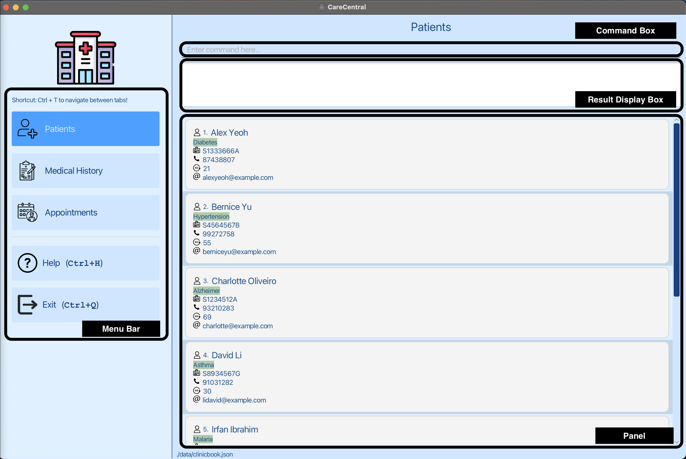

* Table of Contents
{:toc}
--------------------------------------------------------------------------------------------------------------------

# 1. Introduction

CareCentral is an app designed specifically for healthcare professionals, including doctors, nurses, and hospital
staff aged between 25-60 years. It is a desktop app optimised for people who type fast and is designed to help healthcare
professionals manage their patients' medical journey.

<!--- TODO: add release link --->

# 2. Quick Start
1. Ensure you have Java 11 installed in your Computer.
2. Download the latest `carecentral.jar` from [here](https://github.com/AY2324S1-CS2103T-F08-1/tp/releases/tag/v1.3.1).
3. Copy the file to the folder you want to use as the home folder for CareCentral.
4. Double-click the file to start the app. The GUI similar to the below should appear in a few seconds.
   
5. For Mac users who are unable to open the file or encountering this issue, follow this [guide](https://www.theserverside.com/blog/Coffee-Talk-Java-News-Stories-and-Opinions/Run-JAR-file-example-windows-linux-ubuntu). 

  

 

6. Type the command in the command box and press Enter to execute it.
   e.g. typing `help` and pressing Enter will open the help window.
   Some example commands you can try:
   
   * `add-patient n/John Doe ic/S1234567A p/98765432 e/johnd@example.com a/25 t/Diabetic`
   * `list-patients`
   * `delete-patient 1`
   * `exit`

# 3. GUI components

## 3.1. Main screen

## 3.2 Sidebar
The sidebar contains the following tabs:
* Patients
* Medical History
* Appointments

Users can switch between the tabs by clicking on the respective tabs, using the switch command (see here) or using Ctrl+T.

## 3.3 Panel
There are 3 panels in the main screen:
* Patient List Panel
* Medical History Panel
* Appointment Panel

Users can switch between the panels by switching between the respective tabs.

## 3.4 Result Display Box
The result display box displays the result of the command executed.

## 3.5 Command Box
The command box is where the user can type in commands to be executed.

# 4. Common Parameters

| Parameters             | Explanation                 | Constraints                                                                                                                                                 |
|------------------------|-----------------------------|-------------------------------------------------------------------------------------------------------------------------------------------------------------|
| `n/NAME`               | full name of the patient    | must only contain alphanumeric characters and spaces, and it should not be blank                                                                            |
| `p/PHONE_NUMBER`       | phone number of the patient | must be **entirely numeric** and exactly 8 digits long                                                                                                      |
| `ic/NRIC`              | NRIC of the patient         | must be **entirely alphanumeric** and follow Singapore NRIC format. More details [here](https://en.wikipedia.org/wiki/National_Registration_Identity_Card). |
| `a/AGE`                | age of the patient          | must be a positive integer                                                                                                                                  |
| `e/email`              | email of the patient        | must be a valid email address                                                                                                                               |
| `[t/TAG]…`             | tags of the patient         | must only contain alphanumeric characters and spaces, and it should not be blank                                                                            |
| `d/DATE`               | date                        | must be in the format YYYY-MM-DD                                                                                                                            |
| `t/TIME`               | time                        | must be in the format HH:MM (24-hour format)                                                                                                                |
| `pi/PATIENT_INDEX`     | patient index               | must be a positive integer                                                                                                                                  |
| `mc/MEDICAL_CONDITION` | medical condition           | must only contain alphanumeric characters and spaces, and it should not be blank                                                                            |
| `t/TREATMENT`          | treatment                   | must only contain alphanumeric characters and spaces, and it should not be blank                                                                            |
| `mn/MEDICATION_NAME`   | medication name             | must only contain alphanumeric characters, and it should not be blank                                                                                       |

# 5. Glossary

| Word           | Meaning                                                                                                                                                 |
|----------------|---------------------------------------------------------------------------------------------------------------------------------------------------------|
| `CLI`          | Command Line Interface                                                                                                                                  |
| `GUI`          | Graphical User Interface                                                                                                                                |
| `NRIC`         | National Registration Identity Card number, a unique identifier used by the government to track individuals for various purposes, including healthcare. |
| `Prescription` | Medicine prescribed by a medical professional to a patient.                                                                                             |

# 6. Features

**:information_source: Notes about the command format:** 

* Words in `UPPER_CASE` are the parameters to be supplied by the user. 
  e.g. in `add n/NAME`, `NAME` is a parameter which can be used as `add n/John Doe`.

* Items in square brackets are optional. 
  e.g. `n/NAME [t/TAG]` can be used as `n/John Doe t/friend` or as `n/John Doe`.

* Items with `…`​ after them can be used multiple times including zero times. 
  e.g. `[t/TAG]…​` can be used as ` ` (i.e. 0 times), `t/malaria`, `t/asthma t/malaria` etc.

* Parameters can be in any order. 
  e.g. if the command specifies `n/NAME p/PHONE_NUMBER`, `p/PHONE_NUMBER n/NAME` is also acceptable.

* Extraneous parameters for commands that do not take in parameters (such as `help`, `list`, `exit` and `clear`) will be ignored. 
  e.g. if the command specifies `help 123`, it will be interpreted as `help`.  
:warning: <strong>Clear command will clear the entire json file and cannot be undone. Please use with caution. </strong>

* If you are using a PDF version of this document, be careful when copying and pasting commands that span multiple lines as space characters surrounding line-breaks may be omitted when copied over to the application.

## 6.1. Patients Related Features

### 6.1.1. Create Patient Record

**What it does:**
Adds a new patient record to the system.

**Command Format:**
`add-patient n/NAME ic/NRIC a/AGE p/PHONE_NUMBER e/email [t/TAG]…`

**Example Commands:**
`add-patient n/John Doe ic/S0123456A a/45 p/12341234 e/johndoe@example.com`

**Parameters:**

| Parameters       | Explanation                 | Constraints                                                                                                                                                 |
|------------------|-----------------------------|-------------------------------------------------------------------------------------------------------------------------------------------------------------|
| `n/NAME`         | full name of the patient    | must only contain alphanumeric characters and spaces, and it should not be blank                                                                            |
| `p/PHONE_NUMBER` | phone number of the patient | must be **entirely numeric** and exactly 8 digits long                                                                                                      |
| `ic/NRIC`        | NRIC of the patient         | must be **entirely alphanumeric** and follow Singapore NRIC format. More details [here](https://en.wikipedia.org/wiki/National_Registration_Identity_Card). |
| `a/AGE`          | age of the patient          | must be a positive integer                                                                                                                                  |
| `e/email`        | email of the patient        | must be a valid email address                                                                                                                               |
| `[t/TAG]…`       | tags of the patient         | must only contain alphanumeric characters and spaces, and it should not be blank                                                                            |

---
### 6.1.2. List Patients

**What it does:**
List all the patients in the system.

**Command Format:**
`list-patients`

---

### 6.1.3. Edit Patient Record

**What it does:**
Edits a patient record at the specified `PATIENT_INDEX` in the system.

**Command Format:**
`edit-patient PATIENT_INDEX [n/NAME] [ic/NRIC] [a/AGE] [p/PHONE_NUMBER] [e/EMAIL] [t/TAG]…`

**Example Commands:**
`edit-patient 5 n/John Doe ic/S0123456A a/45 p/12341234 e/johndoe@example.com t/critical`

  <strong>:scroll: Additional Info </strong>
  Editing patient tags will override all the patient's existing tags.  
  e.g. <code>edit-patient 5 t/critical</code> will remove all the patient's existing tags and replace it with <code>critical</code>.

**Parameters:**

| Parameters         | Explanation                                        | Constraints                                                                                                                                                 |
|--------------------|----------------------------------------------------|-------------------------------------------------------------------------------------------------------------------------------------------------------------|
| `PATIENT_INDEX`    | index of the patient in the displayed patient list | must be a positive integer                                                                                                                                  |
| `[n/NAME]`         | full name of the patient                           | must only contain alphanumeric characters and spaces, and it should not be blank                                                                            |
| `[p/PHONE_NUMBER]` | phone number of the patient                        | must be **entirely numeric** and exactly 8 digits long                                                                                                      |
| `[ic/NRIC]`        | NRIC of the patient                                | must be **entirely alphanumeric** and follow Singapore NRIC format. More details [here](https://en.wikipedia.org/wiki/National_Registration_Identity_Card). |
| `[a/AGE]`          | age of the patient                                 | must be a positive integer                                                                                                                                  |
| `[e/email]`        | email of the patient                               | must be a valid email address                                                                                                                               |
| `[t/TAG]…`         | tags of the patient                                | must only contain alphanumeric characters and spaces, and it should not be blank                                                                            |

---

### 6.1.4. Delete Patient Record

**What it does:**
Removes a patient record from the system. The patient to be deleted is identified by the index number shown in the displayed list of patients by `list-patients`. **This command will also delete all appointments and medical history associated with the patient.**

**Command Format:**
`delete-patient PATIENT_INDEX`

**Example Commands:**
`delete-patient 2`

**Parameters:**

| Parameters          | Explanation                                        | Constraints                                     |
|---------------------|----------------------------------------------------|-------------------------------------------------|
| `PATIENT_INDEX`     | index of the patient in the displayed patient list | must be a positive integer                      |

---

### 6.1.5. Find Patient Record

**What it does:**
Finds a patient record from the system. Partial words will be matched as well e.g. `John` will match `John Doe`. `Joh` will not match `John Doe`.

**Command Format:**
`find KEYWORD`

**Example Commands:**
`find John Doe`

**Parameters:**

| Parameters | Explanation                                                | Constraints      |
|------------|------------------------------------------------------------|------------------|
| `KEYWORD`  | Keyword to be searched. Keyword refers to the patient name | Must be a string |

---

## 6.2 Appointments Related Features

  <strong>📝 Notes from the Developers </strong>
  We allow appointment dates to be of past and future dates. This allows medical staff to add/reschedule appointments that have already been scheduled in the past.
  The purpose of appointment dates is to keep track of when the patient visited the clinic and to manage the patient's future appointments with them.

### 6.2.1 Add Appointment
**What it does:**
Schedules a new appointment for a patient.

**Command Format:**
`add-appt PATIENT_INDEX d/DATE t/TIME`

**Example Commands:**
`add-appt 1 d/2023-10-01 t/14:00`

**Parameters:**

| Parameters           | Explanation                                        | Constraints                                     |
|----------------------|----------------------------------------------------|-------------------------------------------------|
| `PATIENT_INDEX`      | index of the patient in the displayed patient list | must be a positive integer                      |
| `d/DATE`             | date of the appointment                            | must be in the format YYYY-MM-DD                |
| `t/TIME`             | time of the appointment                            | must be in the format HH:MM (24-hour format)    |

---

### 6.2.2 List All Appointments

  <strong>:warning: Things To Note  </strong>
This command should only be used when there is patient(s) in the patient list.  
    e.g. <code>list-appointments 1</code> will display the appointments(s) of the patient with index 1.  
    If there is no patient in the patient list, you will have to add a patient first before using this command.

**What it does:**
Displays all appointments of the patient.

**Command Format:**
`list-appointments PATIENT_INDEX`

**Example Commands:**
`list-appointments 1`

**Parameters:**

| Parameters           | Explanation                                        | Constraints                                     |
|----------------------|----------------------------------------------------|-------------------------------------------------|
| `PATIENT_INDEX`      | index of the patient in the displayed patient list | must be a positive integer                      |

---

### 6.2.3 Edit Appointment

  <strong>:warning: Things To Note  </strong>
  This command should only be used after <code>list-appointments PATIENT_INDEX</code>

**What it does:**
Edits **existing** appointment details. The appointment to be edited is identified by the index number shown in the displayed list of appointments by `list-appointments`. 

**Command Format:**
`edit-appt APPOINTMENT_INDEX pi/patient-index [d/DATE] [t/TIME]`

**Example Commands:**
`edit-appt 2 pi/7 d/2023-10-05 t/16:00`

  <strong>:scroll: Additional Info </strong>
1. You can only edit the appointments of the patient that is currently being displayed.  
2. e.g. <code>list-appointments 1</code> will display the appointments of the patient with index 1.  
3. <code>edit-appt 2 pi/1 d/2023-10-05 t/16:00</code> will edit the <strong>second</strong> appointment of the patient with index 1.  
4. If you want to edit the appointments of another patient, you will have to use <code>list-appointments PATIENT_INDEX</code> to display the appointments of the patient you want to edit.  
5. You can refer to the patients tab for the patient index.

**Parameters:**

| Parameters          | Explanation                                                                                           | Constraints                                  |
|---------------------|-------------------------------------------------------------------------------------------------------|----------------------------------------------|
| `APPOINTMENT_INDEX` | index of the appointment in the displayed appointment list                                            | must be a positive integer                   |
| `pi/PATIENT_INDEX`  | Index of patient in the patient list. Can refer to patients tab to find out about the patient's index | must be a positive integer                   |
| `[d/DATE]`          | date of the appointment                                                                               | must be in the format YYYY-MM-DD             |
| `[t/TIME]`          | time of the appointment                                                                               | must be in the format HH:MM (24-hour format) |

---

### 6.2.4 Delete Appointment

  <strong>:warning: Things To Note  </strong>
  This command should only be used after <code>list-appointments PATIENT_INDEX</code>

**What it does:**
Removes an appointment from the system. The appointment to be deleted is identified by the index number shown in the displayed list of appointments by `list-appointments`.

**Command Format:**
`delete-appt APPOINTMENT_INDEX pi/patient-index`

**Example Commands:**
`delete-appt 3 pi/2`

**Parameters:**

| Parameters          | Explanation                                                                                           | Constraints                |
|---------------------|-------------------------------------------------------------------------------------------------------|----------------------------|
| `APPOINTMENT_INDEX` | index of the appointment in the displayed appointment list                                            | must be a positive integer |
| `pi/PATIENT_INDEX`  | Index of patient in the patient list. Can refer to patients tab to find out about the patient's index | must be a positive integer |

---

### 6.2.5 Add Prescription

  <strong>:warning: Things To Note  </strong>
  This command should only be used after <code>list-appointments PATIENT_INDEX</code>

**What it does:**
Adds a prescription to a patient's appointment. The appointment to be edited is identified by the index number shown in the displayed list of appointments by `list-appointments`.

**Command Format:**
`add-prescription APPOINTMENT_INDEX pi/PATIENT_INDEX mn/MEDICATION_NAME...`

**Example Commands:**
`add-prescription 1 pi/1 mn/Paracetamol mn/Albuterol`

**Parameters:**

| Parameters           | Explanation                                                                                           | Constraints                                                                                         |
|----------------------|-------------------------------------------------------------------------------------------------------|-----------------------------------------------------------------------------------------------------|
| `APPOINTMENT_INDEX`  | index of the appointment in the displayed appointment list                                            | must be a positive integer                                                                          |
| `pi/PATIENT_INDEX`   | Index of patient in the patient list. Can refer to patients tab to find out about the patient's index | must be a positive integer                                                                          |
| `mn/MEDICATION_NAME` | name of the medication                                                                                | must only contain alphanumeric characters, and it should not be blank, can have multiple medication |

---

### 6.2.6 Edit Prescription

  <strong>:warning: Things To Note  </strong>
  This command should only be used after <code>list-appointments PATIENT_INDEX</code>

**What it does:**
Edits a prescription of a patient. The prescription to be edited is identified by the index number shown in the displayed list of appointments by `list-appointments`.

**Command Format:**
`edit-prescription APPOINTMENT_INDEX pi/PATIENT_INDEX mn/MEDICATION_NAME...`

**Example Commands:**
`edit-prescription 1 pi/1 mn/Panadol mn/Paracetamol mn/Albuterol`

  <strong>:scroll: Additional Info </strong>
1. You can only edit the prescription of the appointments that are currently being displayed.  
2. e.g. <code>list-appointments 1</code> will display the appointments of the patient with index 1.  
3. <code>edit-prescription 2 pi/1 mn/Paracetamol mn/Albuterol</code> will edit the <strong>second</strong> appointment's prescription of the patient with index 1.  
4. If you want to edit the prescription of another patient, you will have to use <code>list-appointments PATIENT_INDEX</code> to display the appointments of the patient you want to edit.  
5. You can refer to the patients tab for the patient index.  
6. Editing prescription will override all the appointment's existing prescription.  
  e.g. <code>edit-prescription 2 pi/1 mn/Paracetamol mn/Albuterol</code> will remove all the appointment's existing prescription and replace it with <code>Paracetamol</code> and <code>Albuterol</code>.

**Parameters:**

| Parameters           | Explanation                                                                                           | Constraints                                                                                         |
|----------------------|-------------------------------------------------------------------------------------------------------|-----------------------------------------------------------------------------------------------------|
| `APPOINTMENT_INDEX`  | index of the appointment in the displayed appointment list                                            | must be a positive integer                                                                          |
| `pi/PATIENT_INDEX`   | Index of patient in the patient list. Can refer to patients tab to find out about the patient's index | must be a positive integer                                                                          |
| `mn/MEDICATION_NAME` | name of the medication                                                                                | must only contain alphanumeric characters, and it should not be blank, can have multiple medication |

### 6.2.7 Delete Prescription

  <strong>:warning: Things To Note  </strong>
  This command should only be used after <code>list-appointments PATIENT_INDEX</code>

**What it does:**
Removes a prescription from the system. The appointment to be deleted is identified by the index number shown in the displayed list of appointments by `list-appointments`.

**Command Format:**
`delete-prescription APPOINTMENT_INDEX pi/PATIENT_INDEX`

**Example Commands:**
`delete-prescription 1 pi/1`

**Parameters:**

| Parameters          | Explanation                                                                                           | Constraints                |
|---------------------|-------------------------------------------------------------------------------------------------------|----------------------------|
| `APPOINTMENT_INDEX` | index of the appointment in the displayed appointment list                                            | must be a positive integer |
| `pi/PATIENT_INDEX`  | Index of patient in the patient list. Can refer to patients tab to find out about the patient's index | must be a positive integer |

---

## 6.3 Medical History Related Features

### 6.3.1 Add Medical History

**What it does:**
Adds a medical history to a patient record.

**Command Format:**
`add-medical-history PATIENT_INDEX d/DATE mc/MEDICAL_CONDITION t/TREATMENT`

**Example Commands:**
`add-medical-history 1 d/2023-10-01 mc/asthma t/ventolin`

  <strong>:warning: Things To Note </strong>
  If there is no treatment available for the medical condition, you can put None for the treatment.
 
  e.g. <code>add-medical-history 1 d/2023-10-01 mc/Cancer t/None</code>
 
 
For the date, we allow it to be in the past, up until today's date, but not future dates.

**Parameter**

| Parameters             | Explanation                                                                                           | Constraints                                                                      |
|------------------------|-------------------------------------------------------------------------------------------------------|----------------------------------------------------------------------------------|
| `PATIENT_INDEX`        | Index of patient in the patient list. Can refer to patients tab to find out about the patient's index | must be a positive integer                                                       |
| `d/DATE`               | date of the medical history                                                                           | must be in the format YYYY-MM-DD                                                 |
| `mc/MEDICAL_CONDITION` | medical condition                                                                                     | must only contain alphanumeric characters and spaces, and it should not be blank |
| `t/TREATMENT`          | treatment                                                                                             | must only contain alphanumeric characters and spaces, and it should not be blank |

---

### 6.3.2 List Medical History

  <strong>:warning: Things To Note  </strong>
This command should only be used when there is patient(s) in the patient list.  
    e.g. <code>list-medical-history 1</code> will display the medical history of the patient with index 1.  
    If there is no patient in the patient list, you will have to add a patient first before using this command.

**What it does:**
Lists the medical history of a patient.

**Command Format:**
`list-medical-history PATIENT_INDEX`

**Example Commands:**
`list-medical-history 1`

**Parameters:**

| Parameters      | Explanation                                                                                           | Constraints                |
|-----------------|-------------------------------------------------------------------------------------------------------|----------------------------|
| `PATIENT_INDEX` | Index of patient in the patient list. Can refer to patients tab to find out about the patient's index | must be a positive integer |

---

### 6.3.3 Edit Medical History

  <strong>:warning: Things To Note  </strong>
  This command should only be used after <code>list-medical-history PATIENT_INDEX</code>

**What it does:**
Edits a medical history of a patient. The medical history to be edited is identified by the index number shown in the displayed list of medical history by `list-medical-history`.

**Command Format:**
`edit-medical-history MEDICAL_HISTORY_INDEX pi/PATIENT_INDEX [d/DATE] [mc/MEDICAL_CONDITION] [t/TREATMENT]`

**Example Commands:**
`edit-medical-history 1 pi/1 d/2023-10-01 mc/asthma t/Levabuterol`

  <strong>:scroll: Additional Info </strong>
1. You can only edit the medical history of the patient that is currently being displayed.  
2. e.g. <code>list-medical-history 1</code> will display the medical history of the patient with index 1.  
3. <code>edit-medical-history 2 pi/1 d/2023-10-01 mc/asthma t/Levabuterol</code> will edit the <strong>second</strong> medical history of the patient with index 1.  
4. If you want to edit the medical history of another patient, you will have to use <code>list-medical-history PATIENT_INDEX</code> to display the medical history of the patient you want to edit.  
5. You can refer to the patients tab for the patient index.

**Parameters:**

| Parameters               | Explanation                                                                                           | Constraints                                                                      |
|--------------------------|-------------------------------------------------------------------------------------------------------|----------------------------------------------------------------------------------|
| `MEDICAL_HISTOY_INDEX`   | index of the medical history in the displayed medical history list                                    | must be a positive integer                                                       |
| `[pi/PATIENT_INDEX]`     | Index of patient in the patient list. Can refer to patients tab to find out about the patient's index | must be a positive integer                                                       |
| `[d/DATE]`               | date of the medical history                                                                           | must be in the format YYYY-MM-DD                                                 |
| `[mc/MEDICAL_CONDITION]` | medical condition                                                                                     | must only contain alphanumeric characters and spaces, and it should not be blank |
| `[t/TREATMENT]`          | treatment                                                                                             | must only contain alphanumeric characters and spaces, and it should not be blank |

---

### 6.3.4 Delete Medical History

  <strong>:warning: Things To Note  </strong>
  This command should only be used after <code>list-medical-history PATIENT_INDEX</code>

**What it does:**
Deletes a medical history of a patient. The medical history to be deleted is identified by the index number shown in the displayed list of medical history by `list-medical-history`.

**Command Format:**
`delete-medical-history MEDICAL_HISTORY_INDEX [pi/PATIENT_INDEX]`

**Example Commands:**
`delete-medical-history 1 pi/1`

**Parameters:**

| Parameters              | Explanation                                                                                           | Constraints                |
|-------------------------|-------------------------------------------------------------------------------------------------------|----------------------------|
| `MEDICAL_HISTORY_INDEX` | index of the medical history in the displayed medical history list                                    | must be a positive integer |
| `pi/PATIENT_INDEX`      | Index of patient in the patient list. Can refer to patients tab to find out about the patient's index | must be a positive integer |

---

## 6.3 System Related Features
### 6.3.1 Switch Tabs

**What it does:**
Switches between the different tabs in the sidebar.

**Command Format:**
`switch TAB_NUMBER`

**Example Command:**
`switch 1`

**Parameters:**

| Parameters   | Explanation                                                                                         | Constraints                                                                      |
|--------------|-----------------------------------------------------------------------------------------------------|----------------------------------------------------------------------------------|
| `TAB_NUMBER` | The target tab to switch to. 1: Patients Tab 2: Medical History Tab 3: Appointments Tab | must only contain alphanumeric characters and spaces, and it should not be blank |

---

# 7. Command Summary

| Action                     | Format                                                                                                      | Examples                                                                          |
|----------------------------|-------------------------------------------------------------------------------------------------------------|-----------------------------------------------------------------------------------|
| **Add Patient**            | `add-patient n/NAME ic/NRIC a/AGE p/PHONE_NUMBER e/email [t/TAG]…`                                          | e.g., `add-patient n/John Doe ic/S0123456A a/45 p/12341234 e/johndoe@example.com` |
| **List Patients**          | `list-patients`                                                                                             | e.g., `list-patients`                                                             |
| **Edit Patient**           | `edit-patient PATIENT_INDEX [n/NAME] [ic/NRIC] [a/AGE] [p/PHONE_NUMBER] [e/EMAIL] [t/TAG]…`                 | e.g., `edit-patient 5 n/John Doe ic/S0123456A a/45 p/12341234`                    |
| **Delete Patient**         | `delete-patient PATIENT_INDEX`                                                                              | e.g., `delete-patient 2`                                                          |
| **Find Patient**           | `find KEYWORD`                                                                                              | e.g., `find John Doe`                                                             |
| **Add Appointment**        | `add-appt PATIENT_INDEX d/DATE t/TIME`                                                                      | e.g., `add-appt 1 d/2023-10-01 t/14:00`                                           |
| **List Appointments**      | `list-appointments PATIENT_INDEX`                                                                           | e.g., `list-appointments 1`                                                       |
| **Edit Appointment**       | `edit-appt APPOINTMENT_INDEX pi/patient-index [d/DATE] [t/TIME]`                                            | e.g., `edit-appt 2 pi/7 d/2023-10-05 t/16:00`                                     |
| **Delete Appointment**     | `delete-appt APPOINTMENT_INDEX pi/patient-index`                                                            | e.g., `delete-appt 3 pi/2`                                                        |
| **Add Prescription**       | `add-prescription APPOINTMENT_INDEX pi/PATIENT_INDEX mn/MEDICATION_NAME...`                                 | e.g., `add-prescription 1 pi/1 mn/Panadol`                                        | 
| **Delete Prescription**    | `delete-prescription APPOINTMENT_INDEX pi/PATIENT_INDEX`                                                    | e.g., `delete-prescription 1 pi/1`                                                |
| **Add Medical History**    | `add-medical-history PATIENT_INDEX d/DATE [mc/MEDICAL_CONDITION t/TREATMENT`                                | e.g., `add-medical-history 1 d/2023-10-01 mc/asthma t/ventolin`                   |
| **List Medical History**   | `list-medical-history PATIENT_INDEX`                                                                        | e.g., `list-medical-history 1`                                                    |
| **Edit Medical History**   | `edit-medical-history MEDICAL_HISTORY_INDEX pi/PATIENT_INDEX [d/DATE] [mc/MEDICAL_CONDITION] [t/TREATMENT]` | e.g., `edit-medical-history 1 pi/1 mc/asthma t/ventolin`                          |
| **Delete Medical History** | `delete-medical-history MEDICAL_HISTORY_INDEX [pi/PATIENT_INDEX]`                                           | e.g., `delete-medical-history 1 pi/1`                                             |
